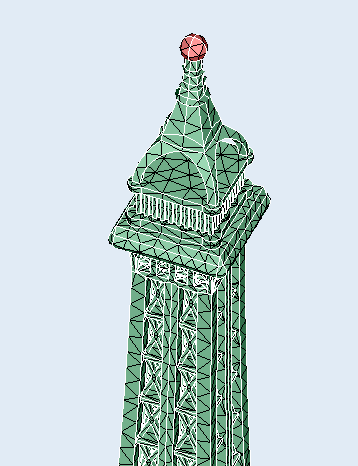

## Model description

Source of model: GrabCAD

## Sets

Node and surface sets `SUPPORT` and `TIP`

## Mesh files

| Mesh file                         | Element type | Avg. element size | Number of nodes | Number of elements |
| --------------------------------- | ------------ | ----------------  | --------------- | ------------------ |
| `EIFFEL_TOWER_TET10_220271.inp`   |        Tet10 |              20.0 |          220271 |              99342 |
| `EIFFEL_TOWER_TET10_376120.inp`   |        Tet10 |              10.0 |          376120 |             175445 |
| `EIFFEL_TOWER_TET10_921317.inp`   |        Tet10 |               5.0 |          921317 |             452245 |
| `EIFFEL_TOWER_TET10_1327989.inp`  |        Tet10 |               4.0 |         1327989 |             674752 |
| `EIFFEL_TOWER_TET10_2357071.inp`  |        Tet10 |               3.0 |         2357071 |            1264177 |
| `EIFFEL_TOWER_TET10_6351068.inp`  |        Tet10 |               2.0 |         6351068 |            3709784 |
| `EIFFEL_TOWER_TET10_13124416.inp` |        Tet10 |               1.5 |        13124416 |            8052327 |
| `EIFFEL_TOWER_TET10_37938922.inp` |        Tet10 |               1.0 |        37938922 |           24788804 |
